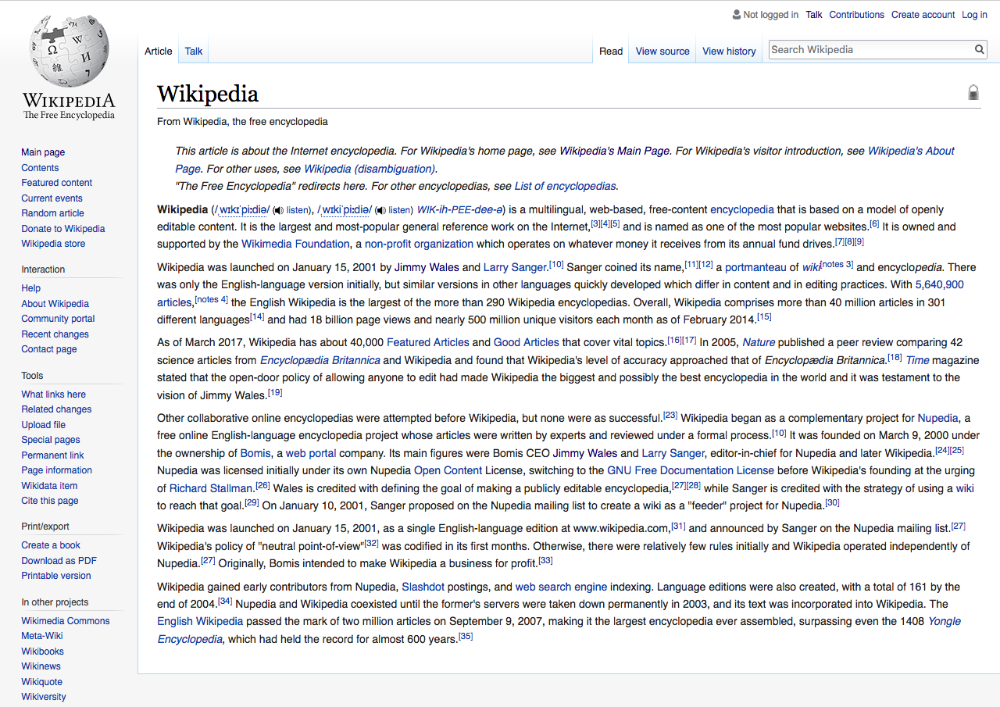

<!-- page_number: true -->


_Markdown:_ a quick tutorial 
===

###### Adapted from https://guides.github.com/features/mastering-markdown/
###### Presented by Gaurav Trivedi ([@trivedigaurav](https://twitter.com/trivedigaurav))

---

# What is Markdown

- A simple way to format text
- Plain text with some extra symbols: `*`, `_`, `#` etc.
- Supports formatting text- **bold** or _italic_, adding images , 
	- and creating lists etc.
- Plus emojis :heart:

> Some other ways to format text: _WikiSyntax, HTML, Word..._

---
# Why Markdown?

- Created in 2004 by John Gruber and Aaron Swartz
- The key design goal: _"readability"_
	- As compared to HTML, etc.
- Easy to markup plain text
- Commonly used in readme files, comments and discussion forums:
	- Websites like [GitHub](github.com), [Reddit](reddit.com) , [StackOverflow](stackoverflow.com) use  it...

---

 

---

 

---

# Basic Text

```
Easy to make words **bold**, *italic* 
and ~~strikethrough~~ text with Markdown. 

Also add links: [GitHub.com](http://github.com)

```

Easy to make words **bold**, *italic* 
and ~~strikethrough~~ text with Markdown. 

Also add links: [GitHub.com](http://github.com)

---

# Lists

```
1. Number one
2. Two

* Start with a star

- Or, dashes 
  - Like this
```

1. Number one
2. Two

* Start with a star

- Or, dashes 
  - Like this

---

# Images

```

```


---

# Headers and quotes

```
# Start lines with a `#` to create headings. 

### Multiple `##` in a row denote smaller heading sizes.

all the way up to six `######`.

> To quote someone, use the > character - Says me!
```
# Start lines with a `#` to create headings.  

### Multiple `##` in a row denote smaller heading sizes.

all the way up to six `######`.

> To quote someone, use the > character ~Says me!
---

# Code

Write code inline, `markdown = true`:
```
Write code inline, ```markdown=true```
```

Or, write code in-between backticks (```):
```javascript
function fancyAlert(arg) {
  if(arg) {
    $.alert({div:'#foo'})
  }
  return true;
}
```
---

# Tables

```
First Header | Second Header
------------ | -------------
Cell 1 | Cell 2
First column | Second column
```

First Header | Second Header
------------ | -------------
Cell 1 | Cell 2
First column | Second column

---
# Flavors of Markdown

1. **CommonMark** - Basic Specification

2. **GitHub Flavored Markdown** 
	- https://github.github.com/gfm/
 	- Some extensions like tables, ~~strikethrough~~ etc.
 	- Described in this presentation

3. **Markdown Extra** - More features for building websites
---

# Group Task

- Where would use you markdown? 

- Ask the following questions:
 	- manage lot of text?
 	- quick and easy to edit? 
	- is readibility important?
---

Annual Health Maintenance Exam

HISTORY OF PRESENT ILLNESS: This 59-year-old white male is seen for comprehensive annual health maintenance examination. Medical problems include chronic tinnitus in the left ear with moderate hearing loss for many years without any recent change.

PHYSICAL EXAMINATION:
He appears alert, oriented, and in no acute distress with excellent cognitive function. VITAL SIGNS: His height is 6 feet 2 inches, weight is 181.2, blood pressure is 126/80,  pulse rate is 68 and regular, and respirations are 16. SKIN: Warm and dry. LUNGS: Clear to percussion and auscultation. Normal sinus rhythm. Heart sounds are of good quality and intensity. ABDOMEN: Benign without guarding, rigidity, tenderness, mass or organomegaly. NEUROLOGIC: Grossly intact. 

---
### Annual Health Maintenance Exam

###### HISTORY OF PRESENT ILLNESS: 
This 59-year-old white male is seen for comprehensive annual health maintenance examination. Medical problems include chronic tinnitus in the left ear with moderate hearing loss for many years without any recent change.

###### PHYSICAL EXAMINATION:
He appears alert, oriented, and in no acute distress with excellent cognitive function.  **Vital Signs:** His height is 6 feet 2 inches, weight is 181.2, blood pressure is 126/80, pulse rate is 68 and regular, and respirations are 16.  **Skin:** Warm and dry. **Lungs:** Clear to percussion and auscultation. Normal sinus rhythm. Heart sounds are of good quality and intensity.  **Abdomen:** Benign without guarding, rigidity, tenderness, mass or organomegaly.  **Neurologic:** Grossly intact.

---
```text
### Annual Health Maintenance Exam

###### HISTORY OF PRESENT ILLNESS: 
This 59-year-old white male is seen for comprehensive annual
health maintenance examination. Medical problems include 
chronic tinnitus in the left ear with moderate hearing loss 
for many years without any recent change.

###### PHYSICAL EXAMINATION:
He appears alert, oriented, and in no acute distress with 
excellent cognitive function. **Vital Signs:** His height is 6 
feet 2 inches, weight is 181.2, blood pressure is 126/80,  
pulse rate is 68 and regular, and respirations are 16. 
**Skin:** Warm and dry. **Lungs:** Clear to percussion and 
auscultation. Normal sinus rhythm. Heart sounds are of good 
quality and intensity. **Abdomen:** Benign without guarding, 
rigidity, tenderness, mass or organomegaly. **Neurologic:** 
Grossly intact.
```
---


## These slides were written in Markdown :+1:

#### Using [Marp](https://github.com/yhatt/marp), markdown presentation writer

#### https://github.com/gauravASC/markdown
